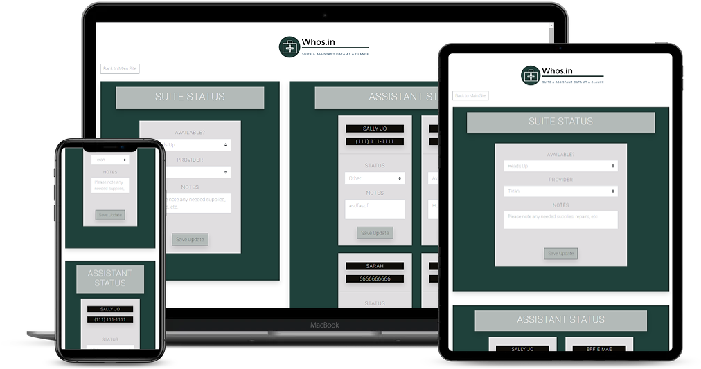

# whos.in

## About
Whos.in is a dashboard for tracking suite and assistant status.  Built for a local birth center seeking a way to share information amongst providers and assistants.  A complete full stack build.  Fully implemented build includes password protection/authentication, but this copy is open for others to browse my code!

## See it Live
See it in action deployed [on Heroku](https://fast-river-36177.herokuapp.com/).

## Built With
- [React](http://www.reactjs.org)
- [Redux](https://react-redux.js.org/)
- [MongoDB](https://www.mongodb.com/)
- [NodeJS](http://nodejs.org)
- [Express](http://www.expressjs.com/)
- [Bootstrap](http://www.getbootstrap.com)

## Installation

Running your own instance of this app will not connect with my databases.  If you would still like to run this app:

1. Clone this repo to your local machine
2. For full functionality you will need to create a keys_dev.js file in the "config" folder containing: 
    - a mongoURI
3. Run <code>npm install</code>
4. Run <code>npm run dev</code>

